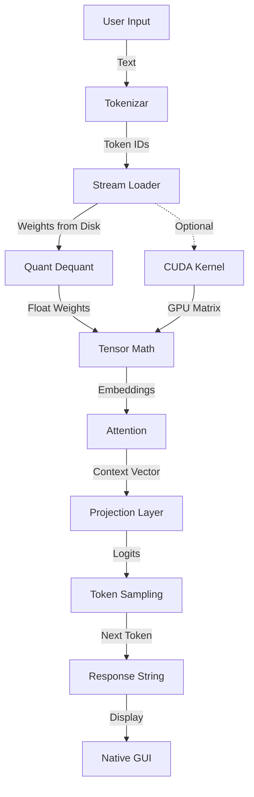

# Architecture

```mermaid
graph TD
    A[User Input] -->|Text| B[Tokenizar]
    B -->|Token IDs| C[Stream Loader]
    C -->|Weights from Disk| D[Quant Dequant]
    D -->|Float Weights| E[Tensor Math]
    E -->|Embeddings| F[Attention]
    F -->|Context Vector| G[Projection Layer]
    G -->|Logits| H[Token Sampling]
    H -->|Next Token| I[Response String]
    I -->|Display| J[Native GUI]
    C -. Optional .-> K[CUDA Kernel]
    K -->|GPU Matrix| E
```
