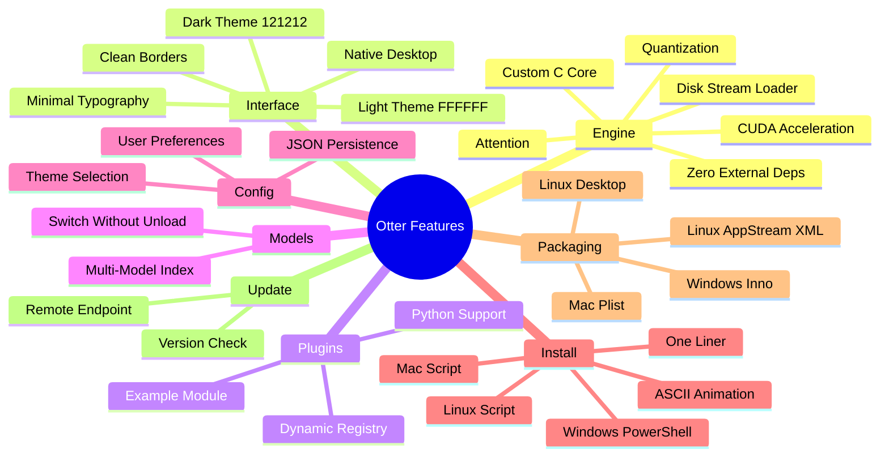

# Feature Architecture

```mermaid
mindmap
  root((Otter Features))
    Engine
      Custom C Core
      Zero External Deps
      Disk Stream Loader
      Quantization
      Attention
      CUDA Acceleration
    Interface
      Native Desktop
      Dark Theme 121212
      Light Theme FFFFFF
      Minimal Typography
      Clean Borders
    Plugins
      Python Support
      Dynamic Registry
      Example Module
    Models
      Multi-Model Index
      Switch Without Unload
    Config
      JSON Persistence
      User Preferences
      Theme Selection
    Install
      One Liner
      ASCII Animation
      Linux Script
      Mac Script
      Windows PowerShell
    Packaging
      Linux Desktop
      Mac Plist
      Windows Inno
      Linux AppStream XML
    Update
      Version Check
      Remote Endpoint
```
