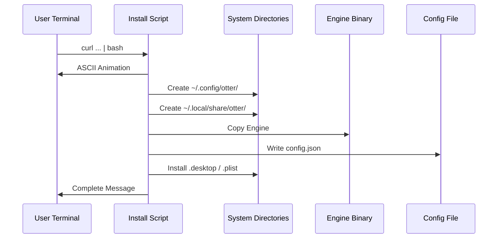

# Installation Flow

```mermaid
sequenceDiagram
    participant U as User Terminal
    participant I as Install Script
    participant D as System Directories
    participant E as Engine Binary
    participant C as Config File
    U->>I: curl ... | bash
    I->>U: ASCII Animation
    I->>D: Create ~/.config/otter/
    I->>D: Create ~/.local/share/otter/
    I->>E: Copy Engine
    I->>C: Write config.json
    I->>D: Install .desktop / .plist
    I->>U: Complete Message
```
