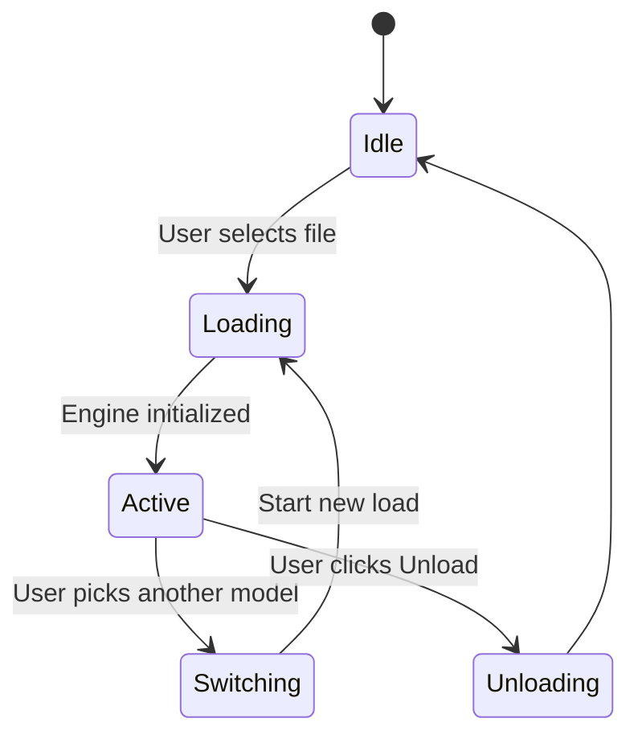

# Multi-Model Switching

```mermaid
stateDiagram-v2
    [*] --> Idle
    Idle --> Loading: User selects file
    Loading --> Active: Engine initialized
    Active --> Switching: User picks another model
    Switching --> Loading: Start new load
    Active --> Unloading: User clicks Unload
    Unloading --> Idle
```
