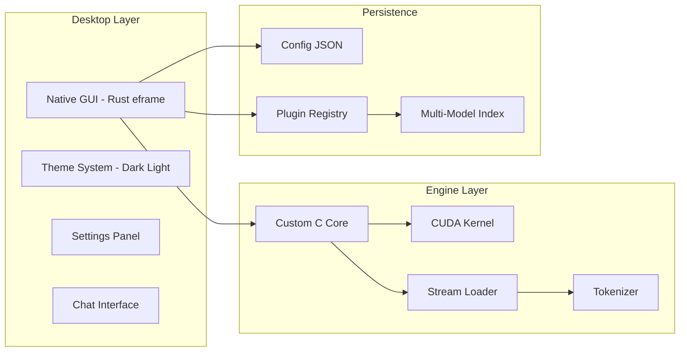

# System Design

```mermaid
graph LR
    subgraph "Desktop Layer"
        A[Native GUI - Rust eframe]
        B[Theme System - Dark Light]
        C[Settings Panel]
        D[Chat Interface]
    end
    subgraph "Engine Layer"
        E[Custom C Core]
        F[CUDA Kernel]
        G[Stream Loader]
        H[Tokenizer]
    end
    subgraph "Persistence"
        I[Config JSON]
        J[Plugin Registry]
        K[Multi-Model Index]
    end
    A --> E
    E --> F
    E --> G
    G --> H
    A --> I
    A --> J
    J --> K
```
